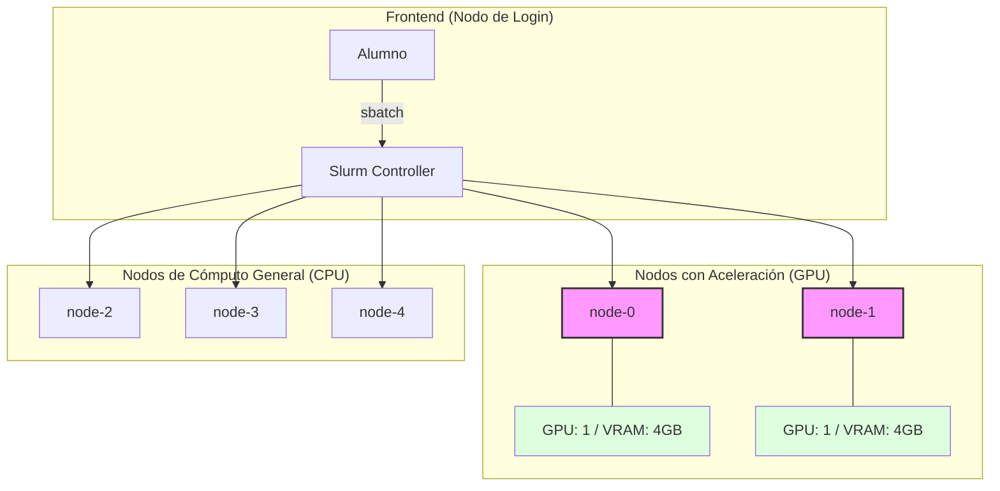

# 🚀 Extensión: Gestión de GPUs y Recursos Genéricos (GRES)

En esta extensión, aprenderás cómo Slurm gestiona hardware especializado. No solo pediremos "núcleos de CPU", sino que aprenderemos a solicitar **GPUs** y **Memoria de Video (VRAM)**.

## 1. Arquitectura del Cluster Heterogéneo

En un entorno real, las GPUs son recursos caros y limitados. Nuestro cluster simulado está dividido en dos tipos de nodos:



## 2. Configuración del Administrador (Simulación)

Para que Slurm reconozca las GPUs, el administrador debe definir los **GRES** (Generic Resources). 

> **Nota Teórica:** En esta práctica usamos un "Mock" (simulación). En un servidor real con AMD, aquí estaríamos mapeando los archivos de dispositivo de `/dev/kfd` y `/dev/dri/`.

### Configuración en `slurm.conf`:
```conf
GresTypes=gpu,vram
NodeName=node-[0-1] Gres=gpu:1,vram:4096
NodeName=node-[2-4] CPUs=1
```

## 3. El Script de Entrenamiento con GPU (`train_gpu.py`)

Crea este archivo en tu carpeta de trabajo. Este script simula el uso de una GPU AMD/NVIDIA y valida si Slurm le ha otorgado los recursos necesarios.

```python
# train_gpu.py (Compatible con Python 3.5.2)
import os
import sys
import time

def main():
    print("--- [GPU-MOCK] Iniciando Proceso de Deep Learning ---")
    
    # 1. Verificar si Slurm asignó el recurso GRES
    gres_alloc = os.getenv('SLURM_JOB_GRES', '')
    requested_vram = int(os.getenv('VRAM_REQUESTED', '0'))
    
    if 'gpu' not in gres_alloc:
        print("❌ ERROR: Este proceso requiere una GPU y no fue asignada.")
        sys.exit(1)

    print("✅ Dispositivo detectado: [AMD Radeon Virtualized Accelerator]")
    
    # 2. Simular uso de VRAM
    limit_vram = 4096
    print("📋 Solicitud de VRAM: {}MB / Disponible en Nodo: {}MB".format(requested_vram, limit_vram))
    
    if requested_vram > limit_vram:
        print("💥 FATAL ERROR: Out of Memory (OOM) en GPU.")
        print("No se pueden cargar los tensores en la memoria de video.")
        sys.exit(1)
    
    # 3. Simular Cómputo
    print("🚀 Entrenando redes neuronales...")
    for i in range(5):
        print("   Epoca {}: Procesando tensores...".format(i))
        time.sleep(1)
    
    print("✨ Entrenamiento completado exitosamente.")

if __name__ == "__main__":
    main()
```

## 4. Lanzando el Trabajo al Cluster (`job_gpu.sh`)

Para pedir una GPU, usamos el flag `--gres`. Crea el siguiente script:

```bash
#!/bin/bash
#SBATCH --job-name=entrenamiento_ia
#SBATCH --output=resultado_gpu_%j.out
#SBATCH --nodes=1
#SBATCH --gres=gpu:1,vram:2048  # Pedimos 1 GPU y 2GB de VRAM

# Definimos una variable para que nuestro script de Python sepa cuánto pedimos
export VRAM_REQUESTED=2048

echo "Lanzando entrenamiento en el nodo: $SLURM_NODELIST"
srun python3 train_gpu.py
```

## 5. Experimentos Sugeridos para el Alumno

### Experimento A: El Nodo Incorrecto
Intenta forzar que el trabajo corra en el `node-2` (que no tiene GPU):
```bash
sbatch --nodelist=node-2 job_gpu.sh
```
*   **Resultado esperado:** El trabajo se quedará en estado `PENDING` indefinidamente porque el `node-2` no cumple con el requisito de `--gres=gpu:1`.

### Experimento B: Exceso de VRAM
Modifica tu script `job_gpu.sh` para pedir `vram:8192` (8GB):
```bash
#SBATCH --gres=gpu:1,vram:8192
```
*   **Resultado esperado:** Slurm rechazará el trabajo o lo dejará en cola porque ningún nodo tiene tanta VRAM.

### Experimento C: Paralelismo Real
Lanza dos veces el mismo script pidiendo 3GB de VRAM cada uno:
```bash
sbatch job_gpu.sh
sbatch job_gpu.sh
```
*   **Análisis:** Verás que uno corre en `node-0` y otro en `node-1`. Si intentas lanzar un tercero, tendrá que esperar a que uno termine, ¡aunque haya CPUs libres! Las GPUs son el "cuello de botella".

---
**Pregunta de reflexión:** 
Si tuvieras un programa que usa la librería **ROCm** de AMD, ¿qué variable de entorno crees que usaría Slurm para decirte *cuál* de todas las GPUs del sistema puedes usar? (Pista: Busca `ROCR_VISIBLE_DEVICES`).
