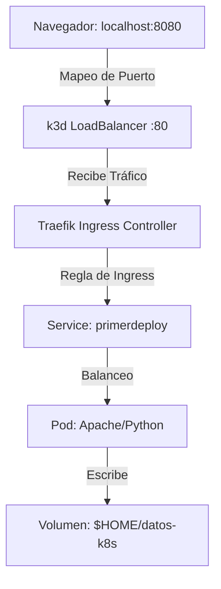

# Práctica de Kubernetes con k3d

Esta guía te llevará a través de los conceptos fundamentales de Kubernetes (K8s) utilizando **k3d**, una herramienta que corre clusters de Kubernetes dentro de contenedores Docker. Es ideal para aprender porque es extremadamente rápido y consume pocos recursos.

### ¿Qué vamos a aprender?
En esta práctica pasaremos por el ciclo de vida completo de una aplicación en K8s:
1.  **Arquitectura de Cluster**: Cómo se comunican tu PC y el cluster.
2.  **Inmutabilidad**: Por qué las imágenes se construyen y se "importan" (no se editan en caliente).
3.  **Ingress (El Portero)**: Aprenderás que en K8s moderno no accedemos directamente a los pods, sino que usamos un "Ingress Controller" (Traefik) que gestiona el tráfico de entrada.
4.  **Resiliencia y Escalado**: Verás cómo K8s revive aplicaciones muertas automáticamente.
5.  **Persistencia**: Cómo lograr que los datos sobrevivan aunque el pod sea destruido.

### Diagrama de Flujo de Red
Así es como llegará tu petición desde el navegador hasta tu código:



---

## Etapa 0: Instalación de herramientas
Si no las tienes, instala `k3d` y `kubectl`:
```bash
# k3d
curl -s https://raw.githubusercontent.com/k3d-io/k3d/main/install.sh | TAG=v5.6.0 bash

# kubectl
curl -LO "https://dl.k8s.io/release/$(curl -L -s https://dl.k8s.io/release/stable.txt)/bin/linux/amd64/kubectl"
chmod +x ./kubectl
sudo mv ./kubectl /usr/local/bin/kubectl
```

## Etapa 1: Levantar el cluster
Creamos el cluster mapeando el puerto 80 del LoadBalancer interno al 8080 de tu PC.
```bash
mkdir -p $HOME/datos-k8s
k3d cluster delete ahk-cluster || true
k3d cluster create ahk-cluster \
  -p "8080:80@loadbalancer" \
  -v "$HOME/datos-k8s:/data@all" \
  --agents 1 --wait
```

## Etapa 2: Primer Deployment (Apache)
**Importante**: K8s es inmutable. Si cambias algo, generas una imagen nueva con un **Tag** (ej: `:v1`). **Nunca** uses `:latest` en producción ni en k3d porque K8s intentará descargarla de internet y fallará.

**Dockerfile**
```dockerfile
FROM httpd
RUN echo "Hola desde Apache en K8s!" > /usr/local/apache2/htdocs/index.html
```

```bash
docker build -t unaapache:v1 .
k3d image import unaapache:v1 -c ahk-cluster

kubectl create deployment primerdeploy --image=unaapache:v1
kubectl expose deployment primerdeploy --port=80

# Ingress: Sin esto, localhost:8080 dará error 404
cat <<EOF | kubectl apply -f -
apiVersion: networking.k8s.io/v1
kind: Ingress
metadata:
  name: apache-ingress
spec:
  rules:
  - http:
      paths:
      - path: /
        pathType: Prefix
        backend:
          service:
            name: primerdeploy
            port:
              number: 80
EOF
```
**Prueba**: `curl http://localhost:8080`

## Etapa 3: Confiabilidad (App Python)
**server.py**
```python
from flask import Flask
import os
app = Flask(__name__)
@app.route('/')
def hello_world(): return 'Hola Mundo! Soy la App de Python'
@app.route('/romper')
def romper(): os._exit(1)
if __name__ == '__main__': app.run(host='0.0.0.0', port=5000)
```

```bash
docker build -t webappvolatil:v1 .
k3d image import webappvolatil:v1 -c ahk-cluster
kubectl create deployment segundodeploy --image=webappvolatil:v1
kubectl expose deployment segundodeploy --port=5000 --name=segundodeployservice
```

## Etapa 4: Escalado y Resiliencia
```bash
kubectl scale deployment/segundodeploy --replicas 3
watch kubectl get pods
```
**Ejercicio**: Abre otra terminal y corre `curl http://localhost:8080/romper`. Observa cómo el pod muere y K8s crea uno nuevo para mantener las 3 réplicas que pediste.

## Etapa 5: Rollouts (Actualizaciones)
```bash
# Cambia algo en server.py...
docker build -t webappvolatil:v2 .
k3d image import webappvolatil:v2 -c ahk-cluster
kubectl set image deployment/segundodeploy webappvolatil=webappvolatil:v2
kubectl rollout status deployment/segundodeploy
```

## Etapa 7: Persistencia (PV/PVC)
Para que K8s use tu carpeta del host, debemos usar `storageClassName: manual`.

**volumen.yml**
```yaml
apiVersion: v1
kind: PersistentVolume
metadata:
  name: mivol
spec:
  storageClassName: manual
  capacity:
    storage: 1Gi
  accessModes: [ReadWriteOnce]
  persistentVolumeReclaimPolicy: Retain
  hostPath:
    path: /data
    type: Directory
```

**volcon.yml**
```yaml
apiVersion: v1
kind: PersistentVolumeClaim
metadata:
  name: mivol-con
spec:
  storageClassName: manual
  accessModes: [ReadWriteOnce]
  resources:
    requests: {storage: 1Gi}
```

## Comandos de Verificación (Cheat Sheet)
- `kubectl logs -f deployment/segundodeploy` (Ver qué pasa dentro)
- `kubectl describe pod [NOMBRE]` (Si el pod no levanta, aquí dice por qué)
- `kubectl get events --sort-by='.lastTimestamp'` (Historial de errores)

## Preguntas de Reflexión
1. ¿Por qué usamos `k3d image import` en lugar de que K8s baje la imagen solo?
2. Si un pod se rompe, ¿K8s lo "arregla" o lo "reemplaza"?
3. ¿Para qué sirve el Ingress si ya tenemos un Service?
4. ¿Qué pasa con los archivos en `/data` si borramos el cluster entero?
