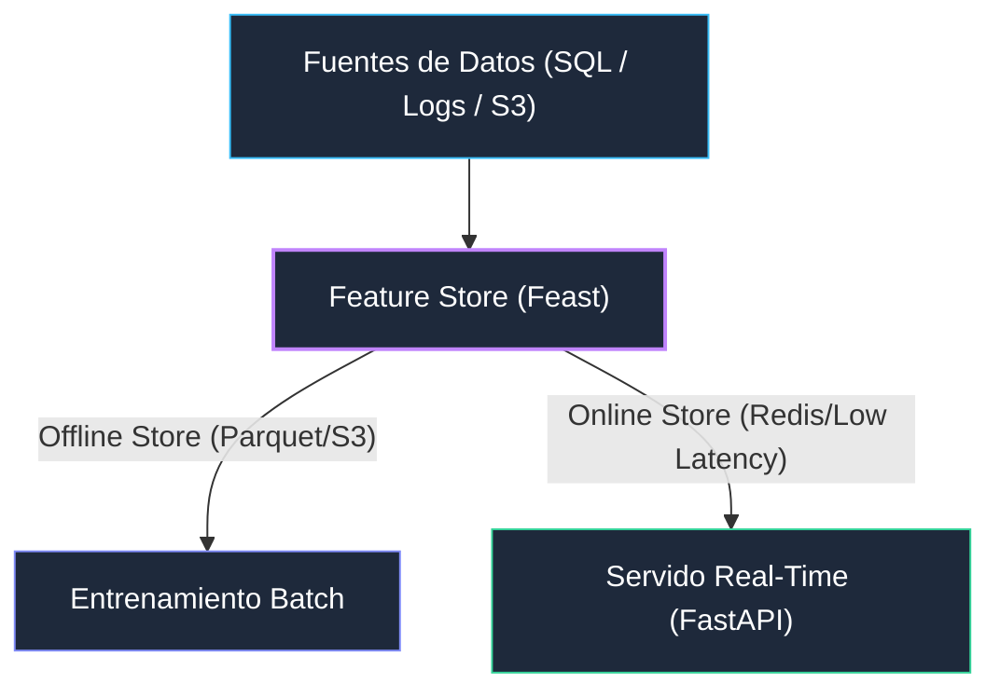

# Práctica de MLOps: Ciclo de Vida Completo de Machine Learning

Esta guía te llevará paso a paso a través de la implementación práctica de un pipeline de **MLOps (Machine Learning Operations)** end-to-end. Construiremos un sistema de predicción de **Cancelación de Clientes (Telco Customer Churn)** pasando por las 5 etapas clave del ciclo de vida:

1. **Versionado de Datos**: Con **DVC (Data Version Control)** y Git.
2. **Tracking de Experimentos y Registro**: Con **MLflow Server**.
3. **Servido en Tiempo Real**: Creando un microservicio REST en **FastAPI** empaquetado en **Docker** utilizando **Pipelines de Scikit-Learn**.
4. **Monitoreo de Data Drift**: Evaluando la degradación del modelo con **Evidently AI**.

---

### 🌐 Arquitectura de la Práctica

```mermaid
graph LR
    Dataset["1. churn.csv (DVC)"] --> Train["2. Train Pipeline (Sklearn)"]
    Train --> MLflow["3. MLflow Server (--serve-artifacts)"]
    MLflow --> Registry["4. Model Registry (Production)"]
    Registry --> API["5. FastAPI + Docker (Port 8000)"]
    API --> Drift["6. Monitoreo Data Drift (Evidently)"]

    style Dataset fill:#0f172a,stroke:#38bdf8,stroke-width:1px,color:#fff
    style Train fill:#0f172a,stroke:#818cf8,stroke-width:1px,color:#fff
    style MLflow fill:#0f172a,stroke:#c084fc,stroke-width:1px,color:#fff
    style Registry fill:#0f172a,stroke:#f472b6,stroke-width:1px,color:#fff
    style API fill:#0f172a,stroke:#34d399,stroke-width:1px,color:#fff
    style Drift fill:#0f172a,stroke:#fbbf24,stroke-width:1px,color:#fff
```



---

## 📚 Módulo Didáctico: Glosario de Herramientas de la Práctica

Antes de comenzar la ejecución de comandos, revisemos el rol que cumple cada tecnología en el ecosistema MLOps:

| Herramienta | ¿Qué es? | Rol en este Laboratorio | ¿Por qué la usamos? |
| :--- | :--- | :--- | :--- |
| **DVC (Data Version Control)** | Sistema open-source para versionar datos y modelos como si fueran código Git. | Rastrea cambios en `churn.csv` sin subir megabytes pesados a Git. | Evita saturar repositorios Git con binarios y garantiza reproducibilidad de datasets. |
| **MLflow Server** | Plataforma para gestionar el ciclo de vida de ML (Tracking, Registry, Artifacts). | Almacena métricas (`accuracy`, `f1`), hiperparámetros y gestiona versiones del modelo (`ChurnModel/1`). | Permite auditar qué código/parámetros generaron el mejor modelo y promover a producción. |
| **Scikit-Learn Pipeline** | Ensamblador de transformaciones de datos y algoritmos de estimación. | Une el preprocesamiento (`OneHotEncoder`) con el clasificador (`RandomForestClassifier`). | Evita la fuga de datos (*Data Leakage*) y permite que la API reciba datos crudos del usuario. |
| **FastAPI** | Framework Python web moderno y ultrarrápido para construir APIs REST. | Expone el endpoint HTTP `POST /predict` en tiempo real. | Provee serialización automática con Pydantic, alta concurrencia y documentación Swagger. |
| **Docker & Docker Compose** | Placa de virtualización por contenedores ligeros. | Aísla el servidor MLflow y el microservicio de inferencia en contenedores portables. | Elimina el problema "en mi computadora funciona" garantizando ejecuciones idénticas. |
| **Evidently AI** | Librería de observabilidad y evaluación de modelos de ML en producción. | Compara los datos de entrenamiento con datos simulados en producción para detectar **Data Drift**. | Alerta cuando la realidad cambia y el modelo requiere re-entrenamiento (CT). |

---

## 🛠️ Requisitos Previos

Asegúrate de contar con las siguientes herramientas en tu sistema:
- **Python 3.9+** y `pip`
- **Docker** y **Docker Compose**
- **Git**

---

## Etapa 0: Preparación del Proyecto y Entorno

1. Crea y posicionate en el **directorio de trabajo único** para toda la práctica:
```bash
mkdir -p $HOME/practica-mlops && cd $HOME/practica-mlops
git init
```
> [!IMPORTANT]
> **Espacio de Trabajo Único (`$HOME/practica-mlops`)**:
> Todos los comandos, archivos (`requirements.txt`, `docker-compose.yml`, `train.py`, `app.py`, `monitor_drift.py`) y configuraciones de Git/DVC de las Etapas 0 a 4 deben crearse y ejecutarse **dentro de este mismo directorio**. Asegúrate de mantener tu terminal abierta en este path.

2. Crea el archivo de dependencias de Python `requirements.txt` con versiones fijadas para garantizar reproducibilidad:
```text
pandas==2.2.1
scikit-learn==1.4.1post1
mlflow==2.11.3
dvc==3.48.0
fastapi==0.110.0
uvicorn==0.28.0
requests==2.31.0
evidently>=0.4.3
pydantic>=2.6.4
setuptools<70.0.0
```

3. Instala las dependencias en tu entorno Python:
```bash
pip install -r requirements.txt
```

4. Levanta el servidor de **MLflow** en un contenedor Docker utilizando `docker-compose.yml`:

Crea el archivo `docker-compose.yml`:
```yaml
version: '3.8'

services:
  mlflow:
    image: ghcr.io/mlflow/mlflow:v2.11.3
    container_name: mlflow_server
    ports:
      - "5000:5000"
    volumes:
      - mlflow_db:/mlflow
    command: mlflow server --host 0.0.0.0 --port 5000 --backend-store-uri sqlite:////mlflow/mlflow.db --default-artifact-root /mlflow/artifacts --serve-artifacts

volumes:
  mlflow_db:
```

Levanta el servicio:
```bash
docker compose up -d
```
> 📌 **Verificación**: Ingresa a tu navegador en `http://localhost:5000` para confirmar que la interfaz de MLflow está lista.

### ❓ Preguntas de Chequeo — Etapa 0
- **P1:** ¿Qué sucede si inicias el servidor de MLflow sin la bandera `--serve-artifacts` cuando intentas descargar un modelo desde otro contenedor Docker?
- **P2:** ¿Por qué fijamos las versiones exactas (`==`) en `requirements.txt` en lugar de instalar las últimas versiones?

---

## Etapa 1: Ingesta y Versionado de Datos con DVC

### 📥 Entradas y Salidas de la Etapa 1
- **Entrada (Input):** URL pública del dataset `Telco-Customer-Churn.csv` en crudo.
- **Proceso:** Inicialización de DVC, asignación de storage remoto local e ingesta con `dvc add`.
- **Salida (Output):** Archivo de metadatos `data/churn.csv.dvc` (rastreado en Git) y archivo binario guardado en el remoto `$HOME/dvc-storage`.

> [!NOTE]
> **¿Por qué usamos DVC junto a Git?**
> Git está diseñado para código fuente (texto). Si guardamos datasets pesados en Git, los repositorios se vuelven extremadamente lentos. DVC crea un archivo pequeño de metadatos (ej: `churn.csv.dvc`) que rastrea la versión exacta del dataset, mientras que el archivo real se almacena en un almacenamiento externo. Para esta práctica, simularemos un almacenamiento en la nube usando una carpeta local.

1. Inicializa DVC y configura un almacenamiento remoto local:
```bash
dvc init
mkdir -p $HOME/dvc-storage
dvc remote add -d localremote $HOME/dvc-storage
```

2. Descarga el dataset oficial de **Telco Customer Churn**:
```bash
mkdir -p data
curl -sL "https://raw.githubusercontent.com/IBM/telco-customer-churn-on-icp4d/master/data/Telco-Customer-Churn.csv" -o data/churn.csv
```

3. Agrega el dataset al control de DVC:
```bash
dvc add data/churn.csv
```
*Esto creará el archivo `data/churn.csv.dvc` y agregará `data/churn.csv` al `.gitignore`.*

4. Guarda el puntero en Git y sincroniza con DVC:
```bash
git add data/churn.csv.dvc data/.gitignore .dvc/config
git commit -m "feat: Ingesta y versionado inicial de dataset churn v1.0"
dvc push
```

### ❓ Preguntas de Chequeo — Etapa 1
- **P1:** Abre el archivo `data/churn.csv.dvc` con `cat`. ¿Qué información contiene este archivo y por qué es seguro guardarlo en Git?
- **P2:** Si un compañero borra accidentalmente `data/churn.csv` de su máquina, ¿con qué comando de DVC puede recuperarlo desde el remoto?

---

## Etapa 2: Entrenamiento y Tracking de Experimentos con MLflow

### 📥 Entradas y Salidas de la Etapa 2
- **Entrada (Input):** Dataset `data/churn.csv` (7043 registros) versionado en la Etapa 1.
- **Proceso:** División train/test (80/20), ajuste de hiperparámetros (`n_estimators=100`, `max_depth=8`) y entrenamiento del `Pipeline` completo (`ColumnTransformer` + `RandomForestClassifier`).
- **Salida (Output):** Registro de métricas (`accuracy`, `f1_score`) en MLflow y exportación del modelo registrado `ChurnModel` (versión 1) en el Registry.

Para evitar la inconsistencia de datos (*Data Leakage*) entre el entrenamiento y producción, utilizaremos un **`Pipeline` de Scikit-Learn** que empaqueta las transformaciones de datos (`ColumnTransformer` + `OneHotEncoder`) junto con el modelo (`RandomForestClassifier`).

Crea el archivo `train.py`:

```python
import os
import pandas as pd
import mlflow
import mlflow.sklearn
from sklearn.model_selection import train_test_split
from sklearn.ensemble import RandomForestClassifier
from sklearn.compose import ColumnTransformer
from sklearn.preprocessing import OneHotEncoder, StandardScaler
from sklearn.pipeline import Pipeline
from sklearn.metrics import accuracy_score, f1_score

# Configurar servidor de MLflow
mlflow.set_tracking_uri(os.getenv("MLFLOW_TRACKING_URI", "http://localhost:5000"))
mlflow.set_experiment("Telco-Churn-Prediction")

print("📥 Cargando dataset...")
df = pd.read_csv("data/churn.csv")

# Preprocesamiento de limpieza inicial
df['TotalCharges'] = pd.to_numeric(df['TotalCharges'], errors='coerce').fillna(0)
df['Churn'] = df['Churn'].apply(lambda x: 1 if x == 'Yes' else 0)

X = df.drop(columns=['customerID', 'Churn'])
y = df['Churn']

categorical_cols = X.select_dtypes(include=['object']).columns.tolist()
numeric_cols = X.select_dtypes(include=['int64', 'float64']).columns.tolist()

# Definir transformador de columnas
preprocessor = ColumnTransformer(
    transformers=[
        ('num', StandardScaler(), numeric_cols),
        ('cat', OneHotEncoder(handle_unknown='ignore'), categorical_cols)
    ]
)

# Empaquetar preprocesamiento y modelo en un Pipeline inmutable
pipeline = Pipeline(steps=[
    ('preprocessor', preprocessor),
    ('classifier', RandomForestClassifier(n_estimators=100, max_depth=8, random_state=42))
])

X_train, X_test, y_train, y_test = train_test_split(X, y, test_size=0.2, random_state=42)

with mlflow.start_run():
    print("🧠 Entrenando Pipeline completo (Transformaciones + Modelo)...")
    pipeline.fit(X_train, y_train)

    predictions = pipeline.predict(X_test)
    acc = accuracy_score(y_test, predictions)
    f1 = f1_score(y_test, predictions)

    print(f"📊 Métricas: Accuracy = {acc:.4f} | F1-Score = {f1:.4f}")

    # Registrar Parámetros y Métricas
    mlflow.log_param("n_estimators", 100)
    mlflow.log_param("max_depth", 8)
    mlflow.log_metric("accuracy", acc)
    mlflow.log_metric("f1_score", f1)

    # Loguear y registrar el Pipeline completo en el Registry
    mlflow.sklearn.log_model(
        sk_model=pipeline,
        artifact_path="model",
        registered_model_name="ChurnModel"
    )

print("✅ Entrenamiento completado. Revisa http://localhost:5000")
```

Ejecuta el script:
```bash
python train.py
```

> 📌 **Verificación en MLflow**: 
> 1. Abre `http://localhost:5000`.
> 2. Haz clic en el experimento `Telco-Churn-Prediction` para ver las métricas del Run.
> 3. Entra al menú **Models** arriba a la izquierda y verás el modelo registrado `ChurnModel` en versión 1.

### ❓ Preguntas de Chequeo — Etapa 2
- **P1:** ¿Cuál es la ventaja pedagógica y técnica de registrar un `Pipeline` completo en MLflow en lugar de registrar únicamente el objeto `RandomForestClassifier` entrenado?
- **P2:** Si cambias `n_estimators=200` y vuelves a correr `python train.py`, ¿qué ocurre en la interfaz de MLflow con los Runs y en el Model Registry con las versiones?

---

## Etapa 3: Servido del Modelo mediante una API REST (FastAPI + Docker)

### 📥 Entradas y Salidas de la Etapa 3
- **Entrada (Input):** Petición HTTP `POST /predict` con un JSON que contiene las 19 características crudas del cliente (`gender`, `Contract`, `MonthlyCharges`, etc.).
- **Proceso:** Carga dinámica del Pipeline `models:/ChurnModel/1` desde MLflow Server y ejecución de la inferencia en tiempo real.
- **Salida (Output):** Respuesta JSON con la predicción (`churn_prediction`: 0 o 1), probabilidad estimada y estado legible (`"Will Churn"` / `"Will Stay"`).

Crearemos un microservicio con **FastAPI** que descargará el Pipeline registrado desde MLflow y ofrecerá un endpoint HTTP `POST /predict`. Gracias al Pipeline, la API puede recibir datos crudos del negocio (strings en lugar de números codificados).

1. Crea el archivo `app.py`:

```python
import os
import pandas as pd
import mlflow.sklearn
from fastapi import FastAPI, HTTPException
from pydantic import BaseModel

# Conectar a MLflow leyendo variable de entorno o fallback local
tracking_uri = os.getenv("MLFLOW_TRACKING_URI", "http://localhost:5000")
mlflow.set_tracking_uri(tracking_uri)

app = FastAPI(title="Telco Churn Prediction API")

# Cargar la versión 1 del Pipeline registrado
model_uri = os.getenv("MODEL_URI", "models:/ChurnModel/1")
try:
    print(f"📦 Cargando Pipeline desde {model_uri}...")
    model = mlflow.sklearn.load_model(model_uri)
except Exception as e:
    print(f"❌ Error al cargar modelo: {e}")
    model = None

class CustomerFeatures(BaseModel):
    gender: str
    SeniorCitizen: int
    Partner: str
    Dependents: str
    tenure: int
    PhoneService: str
    MultipleLines: str
    InternetService: str
    OnlineSecurity: str
    OnlineBackup: str
    DeviceProtection: str
    TechSupport: str
    StreamingTV: str
    StreamingMovies: str
    Contract: str
    PaperlessBilling: str
    PaymentMethod: str
    MonthlyCharges: float
    TotalCharges: float

@app.post("/predict")
def predict_churn(customer: CustomerFeatures):
    if model is None:
        raise HTTPException(status_code=503, detail="Modelo no disponible")
    
    input_data = customer.model_dump() if hasattr(customer, 'model_dump') else customer.dict()
    data = pd.DataFrame([input_data])
    
    prediction = model.predict(data)[0]
    probability = float(model.predict_proba(data)[0][1])
    
    return {
        "churn_prediction": int(prediction),
        "churn_probability": round(probability, 4),
        "status": "Will Churn" if prediction == 1 else "Will Stay"
    }

# Endpoint de salud (Utilizado por las sondas de Kubernetes Liveness/Readiness Probe)
@app.get("/health")
def health():
    return {"status": "ok", "model_loaded": model is not None}
```

2. Crea un `Dockerfile` para empaquetar la API:

```dockerfile
FROM python:3.9-slim

WORKDIR /app

COPY requirements.txt .
RUN pip install --no-cache-dir -r requirements.txt

COPY app.py .

EXPOSE 8000

CMD ["uvicorn", "app:app", "--host", "0.0.0.0", "--port", "8000"]
```

3. Construye y ejecuta el contenedor Docker de la API:

```bash
docker build -t churn-api:v1 .

docker run -d --name churn_api_service \
  -p 8000:8000 \
  -v /mlflow:/mlflow \
  -e MLFLOW_TRACKING_URI="http://host.docker.internal:5000" \
  --add-host=host.docker.internal:host-gateway \
  churn-api:v1
```

4. **Prueba de Inferencia con `curl`** (enviando cadenas reales del cliente):

```bash
curl -X 'POST' \
  'http://localhost:8000/predict' \
  -H 'Content-Type: application/json' \
  -d '{
  "gender": "Female",
  "SeniorCitizen": 0,
  "Partner": "Yes",
  "Dependents": "No",
  "tenure": 1,
  "PhoneService": "No",
  "MultipleLines": "No phone service",
  "InternetService": "DSL",
  "OnlineSecurity": "No",
  "OnlineBackup": "Yes",
  "DeviceProtection": "No",
  "TechSupport": "No",
  "StreamingTV": "No",
  "StreamingMovies": "No",
  "Contract": "Month-to-month",
  "PaperlessBilling": "Yes",
  "PaymentMethod": "Electronic check",
  "MonthlyCharges": 29.85,
  "TotalCharges": 29.85
}'
```

*Respuesta esperada:*
```json
{
  "churn_prediction": 1,
  "churn_probability": 0.6421,
  "status": "Will Churn"
}
```

### ❓ Preguntas de Chequeo — Etapa 3
- **P1:** ¿Por qué en la invocación de Docker utilizamos `--add-host=host.docker.internal:host-gateway`?
- **P2:** Si realizamos una petición `GET http://localhost:8000/health` y devuelve `model_loaded: false`, ¿cuál es el primer lugar donde deberías revisar logs?

---

## Etapa 4: Monitoreo de Data Drift con Evidently AI

### 📥 Entradas y Salidas de la Etapa 4
- **Entrada (Input):** Dataset de referencia `data/churn.csv` (entrenamiento) y lote de producción con datos simulados alterados.
- **Proceso:** Evaluación estadística de la divergencia de distribuciones (KS-Test / Wasserstein Distance) sobre las características numéricas principales.
- **Salida (Output):** Reporte visual interactivo generado en archivo HTML (`drift_report.html`).

Los datos en producción tienden a cambiar respecto a los datos con los que el modelo fue entrenado. Compararemos un lote de datos "actual" simulado con inflación/cambios de comportamiento contra el conjunto de referencia.

Crea el archivo `monitor_drift.py`:

```python
import pandas as pd
from evidently.report import Report
from evidently.metric_preset import DataDriftPreset

print("📊 Cargando datos de referencia (entrenamiento)...")
ref_df = pd.read_csv("data/churn.csv")

# Simular datos de producción con Data Drift (ej: tenure y MonthlyCharges desplazados)
prod_df = ref_df.copy()
prod_df['MonthlyCharges'] = prod_df['MonthlyCharges'] * 1.8  # Aumento significativo en cobros
prod_df['tenure'] = prod_df['tenure'] * 0.3                   # Clientes mucho más nuevos

eval_cols = ['MonthlyCharges', 'tenure', 'SeniorCitizen']

print("🔍 Analizando Data Drift con Evidently AI...")
drift_report = Report(metrics=[DataDriftPreset()])
drift_report.run(
    reference_data=ref_df[eval_cols], 
    current_data=prod_df[eval_cols]
)

report_file = "drift_report.html"
drift_report.save_html(report_file)
print(f"✅ Reporte de Data Drift generado exitosamente: {report_file}")
```

Ejecuta el script:
```bash
python monitor_drift.py
```

> [!TIP]
> **¿Cómo ver el reporte `drift_report.html` en tu navegador?**
> Si estás en tu navegador local, simplemente abre el archivo `drift_report.html`.  
> Si estás en un servidor remoto, WSL o entorno CLI, puedes levantar un servidor HTTP rápido ejecutando:
> ```bash
> python -m http.server 8080
> ```
> Y luego ingresa desde tu navegador a `http://localhost:8080/drift_report.html`.

### ❓ Preguntas de Chequeo — Etapa 4
- **P1:** ¿Cuál es la diferencia entre **Data Drift** (variación en las entradas $X$) y **Concept Drift** (variación en la relación $X \rightarrow Y$)?
- **P2:** En un entorno productivo automatizado, ¿qué acción debería desencadenar una alerta positiva de Data Drift?

---

## 🚀 Conexión con Kubernetes (Opción de Producción)

¿Cómo pasamos del `docker run` local a un cluster en producción?  
En Kubernetes no ejecutamos contenedores aislados, sino **Deployments** de Pods con balanceo de carga.

Ejemplo de manifiesto `k8s-deployment.yaml`:

```yaml
apiVersion: apps/v1
kind: Deployment
metadata:
  name: churn-api-deployment
spec:
  replicas: 2  # 👈 Replicas para Alta Disponibilidad y escalado
  selector:
    matchLabels:
      app: churn-api
  template:
    metadata:
      labels:
        app: churn-api
    spec:
      containers:
      - name: churn-api
        image: churn-api:v1
        ports:
        - containerPort: 8000
        env:
        - name: MLFLOW_TRACKING_URI
          value: "http://mlflow-server:5000"
        readinessProbe: # 👈 Utiliza el endpoint /health que programamos en app.py
          httpGet:
            path: /health
            port: 8000
          initialDelaySeconds: 5
          periodSeconds: 10
```

---

## 📌 Concepto Clave: Feature Store

En arquitecturas MLOps empresariales complejas, se suele incorporar un **Feature Store** (ej. *Feast* o *Hopsworks*):



---

## 🧹 Limpieza del Entorno

Cuando finalices la práctica, puedes detener y eliminar los servicios ejecutando:

```bash
docker stop churn_api_service && docker rm churn_api_service
docker compose down
```
