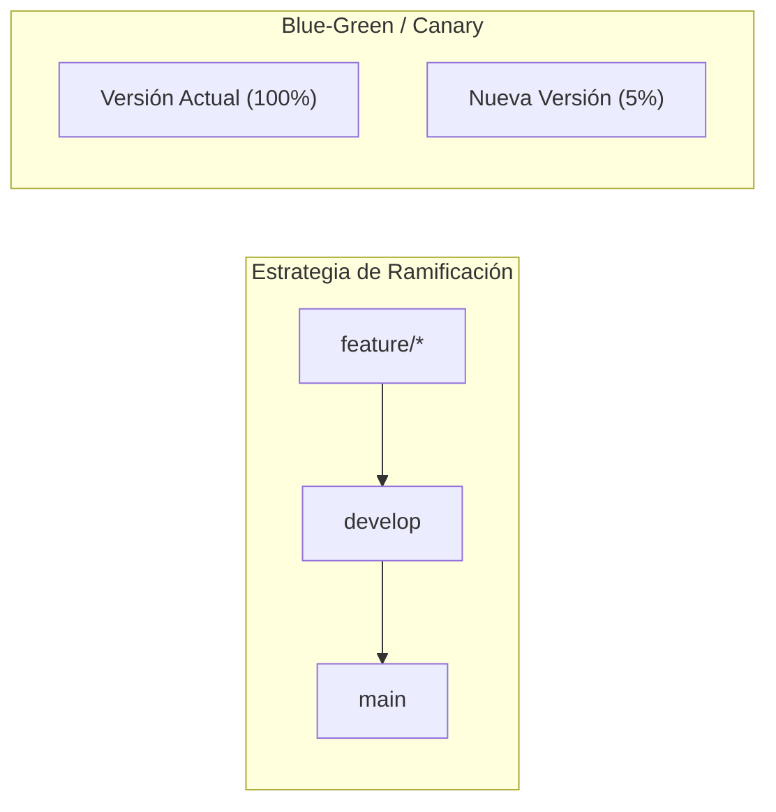

<h2>Estrategias de Ramificación y Despliegue</h2>
Branching &amp; Deploy Strategies

<h3 class="text-sm font-bold text-indigo-300 mb-2">Modelo GitFlow</h3>

        Define la estrategia para el ciclo de vida de ramas y merges entre ellas.

<ul class="text-xs text-slate-300 space-y-1 list-disc list-inside">
<li><code>main / master</code>: Código estable en producción.</li>
<li><code>staging</code>: Pre-producción.</li>
<li><code>development</code>: Integración de características.</li>
<li><code>feature/*</code>, <code>hotfix/*</code>.</li>
</ul>

        ⚠️ <em>Trunk-Based Development surge como alternativa moderna más ágil a GitFlow.</em>

<h3 class="text-sm font-bold text-purple-300 mb-2">Estrategias de Despliegue</h3>

<strong class="text-blue-300">Blue-Green Deployment:</strong> 
          Dos entornos idénticos. Se despliega en "Green" y se conmuta el balanceador de cargas sin downtime.

<strong class="text-amber-300">Canary Release:</strong> 
          Se envía una pequeña fracción del tráfico (ej: 5%) a la nueva versión para validar métricas antes de migrar al 100%.

