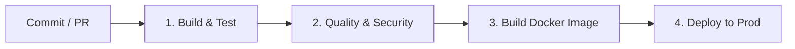

<h2>CI/CD: Integración y Despliegue Continuo</h2>
Pipeline de Automatización

🔄
<h3 class="text-base font-bold text-indigo-300">Continuous Integration (CI)</h3>

        Proceso en el cual el código desarrollado por múltiples integrantes del equipo se integra automáticamente.

<ul class="text-xs text-slate-300 space-y-1 list-disc list-inside">
<li>Push a Git / Pull Request</li>
<li>Servidor compila el código automáticamente</li>
<li>Ejecución de suite de tests automáticos</li>
<li>Generación de reportes de calidad</li>
</ul>

🚀
<h3 class="text-base font-bold text-purple-300">Continuous Deployment (CD)</h3>

        Toma el resultado exitoso del proceso de CI y lo despliega automáticamente en la infraestructura.

<ul class="text-xs text-slate-300 space-y-1 list-disc list-inside">
<li>Construcción y almacenamiento del artefacto (Imagen Docker/Binary)</li>
<li>Despliegue automático a Staging / Producción</li>
<li>Pruebas post-despliegue (Smoke tests)</li>
</ul>

