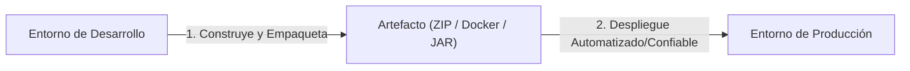

<h2>Pasos para desplegar una aplicación</h2>
Ciclo de Vida

<h3 class="text-xl font-bold text-indigo-300 mb-2">Entorno de Desarrollo</h3>

          Donde los desarrolladores escriben código, construyen características y generan artefactos de software.

<strong>Genera:</strong> Artefacto / Versión (ZIP, JAR, Imagen Docker, binario).

<h3 class="text-xl font-bold text-purple-300 mb-2">Entorno de Release / Producción</h3>

          Entorno operativo donde los usuarios finales interactúan con la aplicación activa.

<strong>Paso clave:</strong> El artefacto se despliega en producción mediante un proceso confiable.

<h4 class="text-sm font-bold text-amber-300 mb-1"> Preguntas para el debate:</h4>
<ul class="text-xs text-slate-300 list-disc list-inside space-y-1">
<li>¿Qué tipos de artefactos existen en sus proyectos actuales?</li>
<li>¿Cómo se lleva a producción cada tipo de artefacto? ¿Es manual o automatizado?</li>
</ul>

