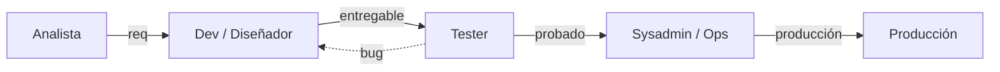

<h2>Organización Tradicional por Función</h2>
Cascada / Silos

<h4 class="text-sm font-bold text-rose-300 mb-1">Problemas de Responsabilidades</h4>

        ¿Qué pasa cuando algo no funciona en producción? "En mi máquina funciona", falta de propiedad compartida y fricción entre equipos.

<h4 class="text-sm font-bold text-cyan-300 mb-1">Soluciones Modernas / SRE</h4>

<strong>Site Reliability Engineering (Google):</strong> Equipos 50% Devs y 50% Sysadmins. 
<em>"You build it, you run it..."</em> (Werner Vogels - Amazon).

