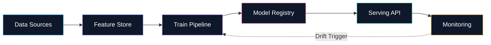

Herramientas & Stack

<h2 class="text-3xl font-bold mb-4">
Ecosistema y Arquitectura MLOps
</h2>

Data &amp; Versioning

DVC, Feast, MinIO, S3

Orquestación

Airflow, Kubeflow, Prefect

Registry &amp; Serving

MLflow, FastAPI, Docker, K8s

Observabilidad

Evidently AI, Prometheus, Grafana

