Proceso End-to-End

<h2 class="text-3xl font-bold mb-4">
El Ciclo de Vida de un Modelo de ML

```mermaid
graph LR
    A["1. Ingeniería de Datos"] --> B["2. Entrenamiento y Tuning"]
    B --> C["3. Validación & Métricas"]
    C --> D["4. Registro del Modelo"]
    D --> E["5. Despliegue en Prod"]
    E --> F["6. Monitoreo en Vivo"]
    F -->|"Re-entrenamiento (Drift)"| A

    style A fill:#1e293b,stroke:#38bdf8,stroke-width:2px,color:#fff
    style B fill:#1e293b,stroke:#818cf8,stroke-width:2px,color:#fff
    style C fill:#1e293b,stroke:#c084fc,stroke-width:2px,color:#fff
    style D fill:#1e293b,stroke:#f472b6,stroke-width:2px,color:#fff
    style E fill:#1e293b,stroke:#34d399,stroke-width:2px,color:#fff
    style F fill:#1e293b,stroke:#fbbf24,stroke-width:2px,color:#fff
```

</h2>

<h4 class="font-bold text-sky-400">Datos & Prep</h4>

Limpieza, transformación de features y versionado del dataset.

<h4 class="font-bold text-purple-400">Experimentos</h4>

Prueba de algoritmos, hiperparámetros y métricas de evaluación.

<h4 class="font-bold text-emerald-400">Operaciones</h4>

Empaquetado (Docker), API de inferencia y monitoreo de drift.

